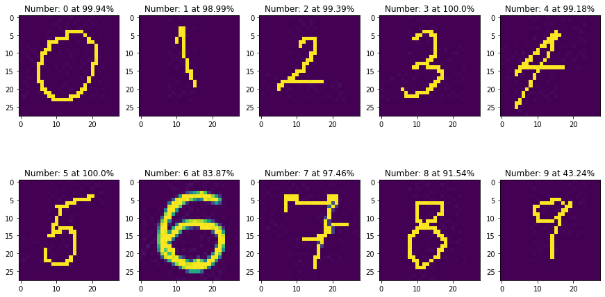

```python
"""
Title: Simple MNIST convnet
Author: [fchollet](https://twitter.com/fchollet)
Date created: 2015/06/19
Last modified: 2020/04/21, by alistairskirk
Description: A simple convnet that achieves ~99% test accuracy on MNIST.
"""

"""
## Setup
"""

import numpy as np
from tensorflow import keras
from tensorflow.keras import layers
from keras.preprocessing import image
import matplotlib.pyplot as plt
import cv2
import os
```


```python
"""
## Prepare the data
"""
# Model / data parameters
num_classes = 10
input_shape = (28, 28, 1)

# the data, split between train and test sets
(x_train, y_train), (x_test, y_test) = keras.datasets.mnist.load_data()

# Scale images to the [0, 1] range
x_train = x_train.astype("float32") / 255
x_test = x_test.astype("float32") / 255
# Make sure images have shape (28, 28, 1)
x_train = np.expand_dims(x_train, -1)
x_test = np.expand_dims(x_test, -1)
print("x_train shape:", x_train.shape)
print(x_train.shape[0], "train samples")
print(x_test.shape[0], "test samples")


# convert class vectors to binary class matrices
y_train = keras.utils.to_categorical(y_train, num_classes)
y_test = keras.utils.to_categorical(y_test, num_classes)
```

    Downloading data from https://storage.googleapis.com/tensorflow/tf-keras-datasets/mnist.npz
    11493376/11490434 [==============================] - 6s 0us/step
    x_train shape: (60000, 28, 28, 1)
    60000 train samples
    10000 test samples
    


```python
"""
## Build the model
"""

model = keras.Sequential(
    [
        keras.Input(shape=input_shape),
        layers.Conv2D(32, kernel_size=(3, 3), activation="relu"),
        layers.MaxPooling2D(pool_size=(2, 2)),
        layers.Conv2D(64, kernel_size=(3, 3), activation="relu"),
        layers.MaxPooling2D(pool_size=(2, 2)),
        layers.Flatten(),
        layers.Dropout(0.5),
        layers.Dense(num_classes, activation="softmax"),
    ]
)

model.summary()
```

    Model: "sequential"
    _________________________________________________________________
    Layer (type)                 Output Shape              Param #   
    =================================================================
    conv2d (Conv2D)              (None, 26, 26, 32)        320       
    _________________________________________________________________
    max_pooling2d (MaxPooling2D) (None, 13, 13, 32)        0         
    _________________________________________________________________
    conv2d_1 (Conv2D)            (None, 11, 11, 64)        18496     
    _________________________________________________________________
    max_pooling2d_1 (MaxPooling2 (None, 5, 5, 64)          0         
    _________________________________________________________________
    flatten (Flatten)            (None, 1600)              0         
    _________________________________________________________________
    dropout (Dropout)            (None, 1600)              0         
    _________________________________________________________________
    dense (Dense)                (None, 10)                16010     
    =================================================================
    Total params: 34,826
    Trainable params: 34,826
    Non-trainable params: 0
    _________________________________________________________________
    


```python
"""
## Train the model
"""

batch_size = 128
epochs = 15

model.compile(loss="categorical_crossentropy", optimizer="adam", metrics=["accuracy"])

model.fit(x_train, y_train, batch_size=batch_size, epochs=epochs, validation_split=0.1)

```

    Epoch 1/15
    422/422 [==============================] - 21s 48ms/step - loss: 0.7670 - accuracy: 0.7621 - val_loss: 0.0834 - val_accuracy: 0.9760
    Epoch 2/15
    422/422 [==============================] - 19s 46ms/step - loss: 0.1285 - accuracy: 0.9608 - val_loss: 0.0549 - val_accuracy: 0.9857
    Epoch 3/15
    422/422 [==============================] - 19s 46ms/step - loss: 0.0909 - accuracy: 0.9714 - val_loss: 0.0489 - val_accuracy: 0.9870
    Epoch 4/15
    422/422 [==============================] - 20s 46ms/step - loss: 0.0717 - accuracy: 0.9769 - val_loss: 0.0444 - val_accuracy: 0.9880
    Epoch 5/15
    422/422 [==============================] - 19s 46ms/step - loss: 0.0657 - accuracy: 0.9791 - val_loss: 0.0410 - val_accuracy: 0.9865
    Epoch 6/15
    422/422 [==============================] - 20s 46ms/step - loss: 0.0602 - accuracy: 0.9811 - val_loss: 0.0390 - val_accuracy: 0.9883
    Epoch 7/15
    422/422 [==============================] - 20s 47ms/step - loss: 0.0548 - accuracy: 0.9833 - val_loss: 0.0338 - val_accuracy: 0.9912
    Epoch 8/15
    422/422 [==============================] - 21s 50ms/step - loss: 0.0485 - accuracy: 0.9843 - val_loss: 0.0337 - val_accuracy: 0.9908
    Epoch 9/15
    422/422 [==============================] - 20s 48ms/step - loss: 0.0460 - accuracy: 0.9847 - val_loss: 0.0351 - val_accuracy: 0.9903
    Epoch 10/15
    422/422 [==============================] - 20s 48ms/step - loss: 0.0417 - accuracy: 0.9869 - val_loss: 0.0334 - val_accuracy: 0.9897
    Epoch 11/15
    422/422 [==============================] - 19s 46ms/step - loss: 0.0438 - accuracy: 0.9860 - val_loss: 0.0332 - val_accuracy: 0.9915
    Epoch 12/15
    422/422 [==============================] - 20s 47ms/step - loss: 0.0394 - accuracy: 0.9873 - val_loss: 0.0293 - val_accuracy: 0.9917
    Epoch 13/15
    422/422 [==============================] - 22s 51ms/step - loss: 0.0396 - accuracy: 0.9876 - val_loss: 0.0319 - val_accuracy: 0.9923
    Epoch 14/15
    422/422 [==============================] - 21s 50ms/step - loss: 0.0344 - accuracy: 0.9889 - val_loss: 0.0309 - val_accuracy: 0.9915
    Epoch 15/15
    422/422 [==============================] - 21s 50ms/step - loss: 0.0353 - accuracy: 0.9888 - val_loss: 0.0291 - val_accuracy: 0.9930
    


    <tensorflow.python.keras.callbacks.History at 0x16825b27be0>


```python
"""
## Evaluate the trained model
"""

score = model.evaluate(x_test, y_test, verbose=0)
print("Test loss:", score[0])
print("Test accuracy:", score[1])
```

    Test loss: 0.025978323072195053
    Test accuracy: 0.9907000064849854
    


```python
folder="test/" # test images
images = []
for filename in os.listdir(folder):
    img_ = cv2.imread(os.path.join(folder,filename),0) #using 0 for grayscale read in, maybe dont invert?
    if ((img_ is not None)&(filename.endswith('.jpg'))):
        images.append(img_)
print("Analyzing, {:s} images".format(str(len(images))))

image_set = []      
for img in images:
    #img = image.load_img(img_path, target_size=(28, 28), color_mode = 'grayscale')
    img_tensor = image.img_to_array(img)                    # (height, width, channels)
    img_tensor = np.expand_dims(img_tensor, axis=0)         # (1, height, width, channels), add a dimension because the model expects this shape: (batch_size, height, width, channels)
    #print(img_tensor)
    img_tensor /= 255.                                      # imshow expects values in the range [0, 1]
    img_tensor = 1 - img_tensor                             # invert the matrix values 1->0, 0->1 because import grayscale inverts image
    image_set.append(img_tensor)

f, ax = plt.subplots(2,round(len(images)/2),figsize=(15,8)) 

idx = -1
row = 0

for img_tensor in image_set:
    #plt.imshow(img_tensor[0])                           
    #plt.axis('off')
    #plt.show()
    #print(idx)
    if (idx>=round(len(images)/2)-1):
        idx = 0
        row+=1
    else: idx+=1
    #print(idx)    
    ax[row,idx].imshow(img_tensor[0]-1)
    
    predmatrix = model.predict(img_tensor)
    #print("Number: ",np.argmax(predmatrix))
    #print("with {:.3}".format(np.max(predmatrix)*100),'% conf.')
    title_string = "Number: "+str(np.argmax(predmatrix))+" at {:.4}".format(np.max(predmatrix)*100)+'%'
    ax[row,idx].set_title(title_string)

```

    Analyzing, 10 images
    


    

    


```python

```
